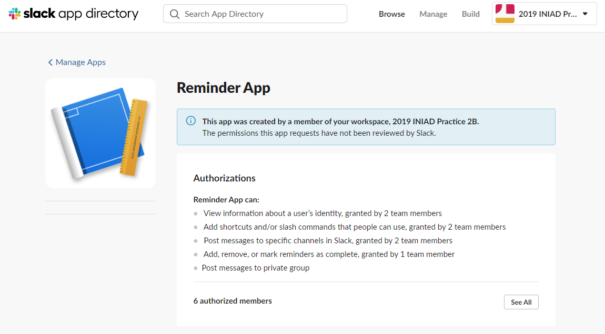

# slack-reminder-app
- A reminder extension for Slack. Reminder can be set from the Slack chat itself. 
- Used Slack API (JSON) to set the reminder. Website to display the reminders was made with Django framework. 
- Reminders are displayed on [this website](https://iniad-practice2b.herokuapp.com/) (Heroku app).

